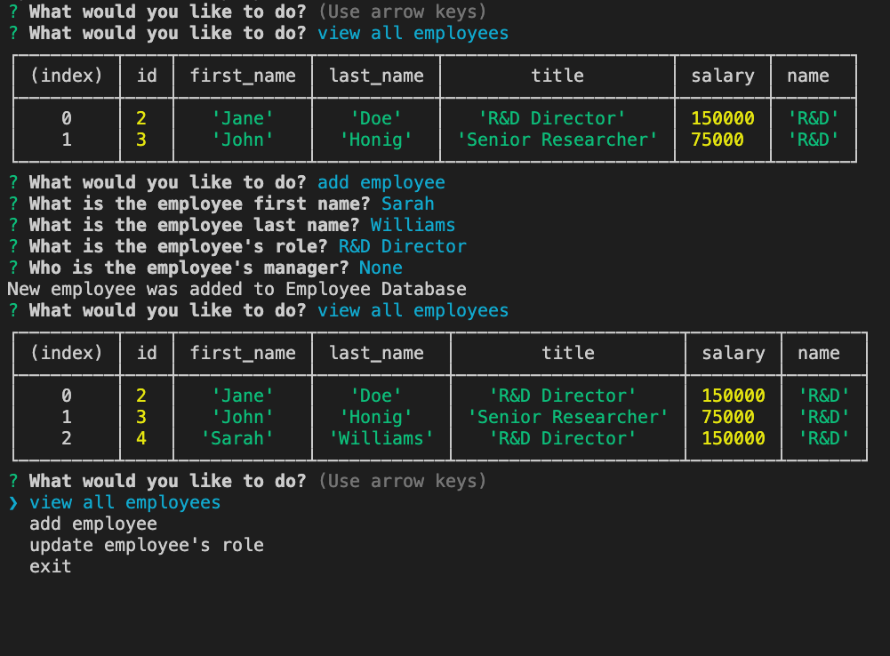

# employee-tracker
This app facilitates non-developer users' interactions with employee database

## Getting Started

* clone me, or fork me
* [github pages] (https://ir-p.github.io/employee-tracker/)

* Screen shot of the deployed app: 
* [Watch the video](https://drive.google.com/file/d/1J2Nn1_K0bZQBewmSfuCasMtuwBt1uwhj/view?usp=sharing)

## Deployment
* just deploy, no other actions needed

## Build With 

* [MySQL Queries] (https://dev.mysql.com/doc/mysql-tutorial-excerpt/8.0/en/examples.html) - MySQL Queries

## Acknowledgements
* **Billie Thompson** - *README template* - [PurpleBooth](https://github.com/PurpleBooth))
